# Product Requirements Document (PRD)
# RawAgents Built-in Web Tools

**Version:** 2.3
**Date:** February 2026
**Status:** Draft (v2.3 — Dev team review complete: all issues fixed, FAQ added, implementation-ready)
**Author:** Tawab Safi

---

## Table of Contents

1. [Executive Summary](#1-executive-summary)
2. [Background & Motivation](#2-background--motivation)
3. [Goals & Non-Goals](#3-goals--non-goals)
4. [Tool Inventory](#4-tool-inventory)
5. [Tool Specifications](#5-tool-specifications)
6. [Security Architecture](#6-security-architecture)
7. [Content Processing (Extensibility)](#7-content-processing-extensibility)
8. [Implementation Approach](#8-implementation-approach)
9. [Reference Implementations](#9-reference-implementations)
10. [Testing Strategy](#10-testing-strategy)
11. [Project Structure](#11-project-structure)
12. [Development Process](#12-development-process)
13. [Error Handling and Logging](#13-error-handling-and-logging)
14. [Developer FAQ & Design Decisions](#14-developer-faq--design-decisions)

---

## 1. Executive Summary

### 1.1 What We're Building

The **Web Tools** module (`rawagents.tools.builtin.web`) provides core web interaction capabilities needed to build Claude Code-like agents. These tools enable agents to search the web and fetch page content, extracting information and performing research tasks.

Following RawAgents' **"Primitives over Frameworks"** philosophy, each tool is:
- A standalone, single-purpose function
- Independently testable
- Composable with other tools
- Usable without the full RawAgents framework

### 1.2 Key Decisions

| Decision | Choice | Rationale |
|----------|--------|-----------|
| **Configuration** | Single unified `WebContext` (matches fs/shell pattern) | One config object, one setter, one mental model |
| **Search Architecture** | Provider-agnostic Protocol with Brave built-in | Brave out-of-the-box; users implement Protocol for custom providers |
| **Default Search Provider** | Brave Search | Fast, reliable, good free tier (2k/mo); same backend as Claude Code |
| **Content Processing** | `ContentProcessor` Protocol — first-class extensibility hook | Users can add post-fetch processing (trust checks, extraction) without modifying tools |
| **HTTP Client** | `httpx` async | Matches RawAgents async-first architecture; supports HTTP/2 |
| **HTML Conversion** | `markdownify` library | Python equivalent of Turndown (used by Claude Code & OpenCode) |
| **Caching** | 15-minute in-memory TTL | Balances freshness with performance; module-level singleton per-process |
| **Output Formats** | Markdown (default), Text, HTML | Same as OpenCode |
| **Redirect Handling** | Flag in output, not auto-follow cross-host | Prevents auth/CSRF issues on cross-host redirects |
| **SSRF Prevention** | Private IP blocking + domain blocklist | Defense-in-depth against internal network attacks |

### 1.3 Zero-Config Quick Start

```python
# Step 1: Set environment variable
# export BRAVE_API_KEY=BSA-xxxxx

# Step 2: Use tools
from rawagents.tools.builtin.web import web_search, web_fetch

results = await web_search(query="python asyncio patterns")
content = await web_fetch(url="https://docs.python.org/3/library/asyncio.html")
```

That's it. No manual config required — tools auto-create a `WebContext` with sensible defaults.

### 1.4 Tools Summary

| Tool | Purpose | Priority |
|------|---------|----------|
| `web_search` | Search the web using pluggable providers | P0 |
| `web_fetch` | Fetch and convert web page content | P0 |

### 1.5 System Architecture Overview

The following diagram shows how all components in the web tools module relate to each other. This is the "big picture" that ties together every section of this PRD.

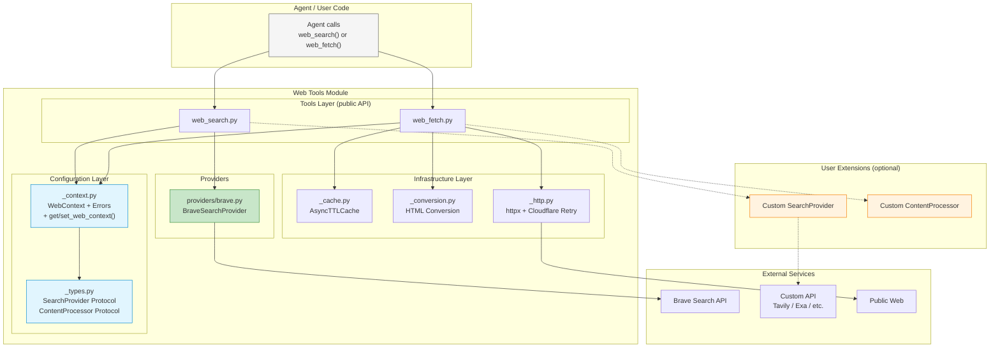

**Legend:**
- **Blue** = Configuration layer (WebContext) — the single object everything depends on
- **Green** = Built-in provider (Brave) — ships with RawAgents
- **Orange** = User-extensible components — implement Protocols to plug in
- **Solid arrows** = built-in dependency; **Dashed arrows** = optional user extension

---

## 2. Background & Motivation

### 2.1 Problem Statement

To build Claude Code-like agents with RawAgents, developers need reliable web interaction tools that:

1. **Search the web** - Answer research questions, find documentation, discover resources
2. **Fetch web content** - Read documentation, extract information, analyze web pages
3. **Handle different providers** - Use different search backends without changing agent code
4. **Are secure** - Prevent SSRF attacks, respect domain restrictions, block private IPs
5. **Work with LLMs** - Clear schemas, predictable outputs, good error messages

### 2.2 Why Not Use Existing Packages?

| Option | Issue |
|--------|-------|
| `requests` library | Blocking I/O, doesn't match RawAgents async-first design |
| `bs4` (BeautifulSoup) for HTML parsing | Designed for parsing, not conversion; no HTML→Markdown |
| `selenium`/`playwright` | Overkill for simple fetch; heavy dependencies, slow |
| Single-provider SDKs | Locks agents into one provider; users want flexibility |
| OpenAI's `web_search` (Claude Code) | Server-side only, not replicable in open-source |
| LangChain web tools | Heavy framework dependency, not standalone |

### 2.3 Our Approach

Build **provider-agnostic web tools** with:
- **httpx** for async HTTP (matches RawAgents architecture)
- **markdownify** for HTML→Markdown conversion (Python equivalent of Turndown)
- **SearchProvider Protocol** - Brave built-in; users implement the interface for custom providers
- **ContentProcessor Protocol** - First-class extensibility hook for post-fetch processing
- **Security-first** - SSRF prevention, domain filtering, rate limiting
- **Single unified WebContext** - One config object matching fs/shell module patterns

---

## 3. Goals & Non-Goals

### 3.1 Goals

**G1: Feature Parity with Claude Code's Web Capabilities**
- Web search with multiple result formats
- Web fetch with HTML→Markdown conversion
- Same security patterns (SSRF prevention, domain filtering)

**G2: Brave by Default, Custom Providers via Protocol**
- Ship BraveSearchProvider as the built-in default
- SearchProvider Protocol for plug-and-play custom providers (Tavily, Exa, or any other)
- Users implement the Protocol in ~20 lines of code

**G3: Easy Post-Fetch Extensibility**
- ContentProcessor Protocol as a first-class hook for post-fetch processing
- Users can implement Claude Code-style Haiku extraction, trust checks, or filtering
- Not provided by default — just a clean, easy-to-implement interface

**G4: Security by Default**
- SSRF prevention (private IP blocking)
- Domain allow/blocklist support
- Rate limiting configuration
- Response size limits
- Timeout enforcement

**G5: Zero-Config for Common Case**
- Set `BRAVE_API_KEY` env var → tools work immediately
- No manual `WebContext` creation needed for default usage
- Single unified config for when customization is needed

**G6: LLM-Optimized Output**
- Clear, structured result format
- Meaningful error messages
- Redirect detection without auto-following
- Content truncation with helpful messages

**G7: Performance**
- 15-minute URL cache (in-memory)
- Async HTTP to avoid blocking
- Content truncation (100KB text) to fit in context windows
- Configurable rate limiting

### 3.2 Non-Goals

**NG1: Browser Emulation**
- No JavaScript execution (Selenium/Playwright out of scope)
- Static HTML fetch only

**NG2: Server-Side Search**
- Not replicating Claude Code's server-based infrastructure
- Client-side API integration only

**NG3: Built-in Content Extraction**
- No automatic data extraction by default
- ContentProcessor Protocol provides the hook; users implement extraction

**NG4: Authentication**
- No OAuth/login support
- No cookie persistence
- Public content only

**NG5: Multiple Built-in Providers**
- Ship only Brave; other providers (Tavily, Exa) are documented examples
- Reduces maintenance burden; demonstrates Protocol extensibility

---

## 4. Tool Inventory

### 4.1 Priority 0 (Must Have)

```
┌─────────────────────────────────────────────────────────────────┐
│                    PRIORITY 0: CORE TOOLS                        │
├─────────────────────────────────────────────────────────────────┤
│  web_search │ Search the web using pluggable providers          │
│  web_fetch  │ Fetch and convert web page content                │
└─────────────────────────────────────────────────────────────────┘
```

---

## 5. Tool Specifications

### 5.1 Web Search Tool

**Purpose:** Search the web using a pluggable provider (Brave by default, or any custom provider).

**Parameters:**

| Parameter | Type | Required | Default | Description |
|-----------|------|----------|---------|-------------|
| `query` | str | ✅ | - | The search query (e.g., "python asyncio documentation") |
| `num_results` | int | ❌ | 10 | Number of results to return (max 20) |
| `allowed_domains` | list[str] | ❌ | None | If set, only return results from these domains (e.g., ["docs.python.org", "github.com"]) |
| `blocked_domains` | list[str] | ❌ | None | If set, exclude results from these domains (e.g., ["pinterest.com"]) |

**Output Format (String):**

```
Found 5 results for "python asyncio patterns"

1. [Asyncio Documentation](https://docs.python.org/3/library/asyncio.html)
   The asyncio library provides tools for writing concurrent code using async/await syntax.

2. [Real Python: Asyncio Tutorial](https://realpython.com/async-io-python/)
   A comprehensive guide to async programming in Python, covering coroutines, tasks, and event loops.

3. [GitHub: aio-libs](https://github.com/aio-libs)
   A collection of asyncio-based libraries for HTTP clients, web servers, and more.
```

**Behavior:**

- **Provider Selection**: Uses `WebContext.search_provider`. If None, auto-creates BraveSearchProvider from `BRAVE_API_KEY` env var
- **Result Format**: Returns list of SearchResult objects, formatted as numbered markdown links
- **Domain Filtering**:
  - If `allowed_domains` is set, only return results matching those domains
  - If `blocked_domains` is set, exclude results from those domains
  - Error if both are specified: `"Error: Cannot use both allowed_domains and blocked_domains"`
- **Query Validation**:
  - Reject empty queries: `"Error: Search query cannot be empty"`
  - Strip leading/trailing whitespace
- **Result Count**:
  - Respect `num_results` parameter (max 20, default 10)
  - Provider may return fewer results if not available
- **Error Handling**:
  - No provider configured: `"Error: No search provider configured. Set BRAVE_API_KEY environment variable, or pass a custom SearchProvider to WebContext."`
  - Provider API error: `"Error: Search failed: {provider} returned {status_code}: {details}"`
  - Rate limit hit: `"Error: Search rate limit exceeded. Try again in {retry_after} seconds."`

**Security Checks (WebContext):**
- Applied to result URLs (block private IPs, check domain allowlist/blocklist)
- Results pointing to blocked domains are filtered out
- Rate limiting enforced via context

**Request Flow:**

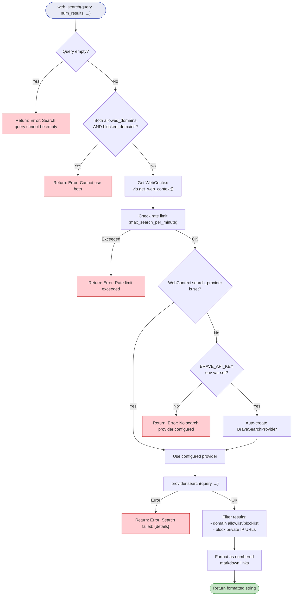

**Example:**

```python
# Basic search (zero-config — just needs BRAVE_API_KEY env var)
results = await web_search(query="python asyncio")

# With domain filtering
results = await web_search(
    query="documentation",
    num_results=5,
    allowed_domains=["docs.python.org", "readthedocs.io"]
)

# Excluding domains
results = await web_search(
    query="python tutorials",
    blocked_domains=["pinterest.com", "medium.com"]
)
```

**Schema (JSON):**

```json
{
  "type": "object",
  "properties": {
    "query": {
      "type": "string",
      "description": "The search query",
      "minLength": 1,
      "maxLength": 500
    },
    "num_results": {
      "type": "integer",
      "description": "Number of results to return (max 20)",
      "minimum": 1,
      "maximum": 20,
      "default": 10
    },
    "allowed_domains": {
      "type": ["array", "null"],
      "items": { "type": "string" },
      "description": "Only return results from these domains"
    },
    "blocked_domains": {
      "type": ["array", "null"],
      "items": { "type": "string" },
      "description": "Exclude results from these domains"
    }
  },
  "required": ["query"],
  "additionalProperties": false
}
```

---

### 5.2 Web Fetch Tool

**Purpose:** Fetch a web page and convert content to markdown/text/html format. Follows OpenCode's simple approach: fetch → convert → return. Extensible via optional ContentProcessor.

**Parameters:**

| Parameter | Type | Required | Default | Description |
|-----------|------|----------|---------|-------------|
| `url` | str | ✅ | - | The URL to fetch (must start with http:// or https://) |
| `prompt` | str | ❌ | "" | Context/question about what information to extract (passed to ContentProcessor if configured) |
| `format` | Literal["markdown", "text", "html"] | ❌ | "markdown" | Output format |
| `timeout` | int | ❌ | 30 | Request timeout in seconds (max 120) |

**Output Format (String):**

For successful fetch (markdown format):
```
# Page Title

Content converted to markdown...

## Section

More content here...

[Content truncated at 100KB. Full page available at: https://example.com]
```

For errors:
```
Error: HTTP 404: Not Found
```

For cross-host redirects:
```
Redirect detected: https://example.com/old redirects to https://newhost.com/page.
Fetch the new URL directly if needed: https://newhost.com/page
```

**Behavior:**

- **URL Validation**:
  - Must start with `http://` or `https://`
  - Error: `"Error: URL must start with http:// or https://"`
  - Domain must be in allowed list (if configured)
  - Domain must not be in blocked list

- **Security Checks (WebContext)**:
  - SSRF prevention: block private IPs (10.x, 172.16.x, 192.168.x, 127.x, ::1)
  - Error: `"Error: Cannot fetch private/internal URLs (resolved to {ip})"`
  - Check domain allowlist/blocklist
  - Rate limiting enforcement

- **HTTP Request**:
  - Uses httpx with configured User-Agent: `"RawAgents/1.0 (+https://github.com/tawab-safi/rawagents)"`
  - Follows redirects by default (up to 5 hops)
  - If cross-host redirect detected, flag in output instead of auto-following
  - Timeout enforced (default 30s, max 120s)
  - Error on timeout: `"Error: Request timed out after {N} seconds"`

- **Response Size Limits**:
  - Max response: 5 MB bytes
  - Max text output: 100,000 characters
  - Error if exceeded: `"Error: Response exceeds 5MB size limit"`
  - If text truncated: append `"[Content truncated at 100KB...]"`
  - **Enforcement strategy**: Use httpx streaming to avoid buffering oversized responses into memory. Read the response in chunks, tracking total bytes. Abort early if the 5MB threshold is crossed. This prevents OOM on very large responses (e.g., database dumps). If `Content-Length` header is present and exceeds 5MB, reject immediately without reading the body.

- **Content Conversion**:
  - **Markdown** (default): HTML→Markdown via markdownify (ATX heading style)
  - **Text**: Strip HTML tags, return plain text
  - **HTML**: Return raw HTML as-is
  - Trailing newline normalization

- **Cloudflare Retry** (from OpenCode):
  - On 403 with `cf-mitigated` header, retry once with simplified User-Agent
  - Use: `"RawAgents/1.0"`
  - If still 403, return error

- **Content Processor Hook** (optional):
  - If `WebContext.content_processor` is set, apply it to content after conversion
  - See Section 7 for full ContentProcessor documentation

- **Caching**:
  - Check 15-minute cache before HTTP request
  - Cache hit returns content from memory
  - Cache miss fetches, converts, and stores

**Request Flow:**

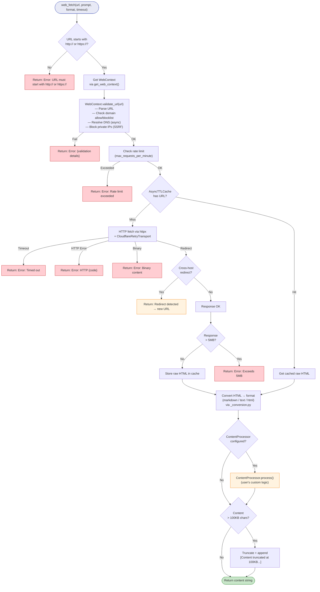

**Error Cases:**

| Error | Message |
|-------|---------|
| Missing `http://` or `https://` | `Error: URL must start with http:// or https://` |
| Domain blocked | `Error: Domain '{domain}' is blocked` |
| Private IP (SSRF) | `Error: Cannot fetch private/internal URLs` |
| Response too large | `Error: Response exceeds 5MB size limit` |
| HTTP error (4xx/5xx) | `Error: HTTP {code}: {reason}` |
| Timeout | `Error: Request timed out after {N} seconds` |
| Connection refused | `Error: Failed to connect to {domain}: {reason}` |
| Invalid URL | `Error: Invalid URL: {details}` |
| Binary content | `Error: Cannot fetch binary content (Content-Type: {ct})` |

**Example:**

```python
# Basic fetch (zero-config)
content = await web_fetch(url="https://docs.python.org")

# With custom format
content = await web_fetch(
    url="https://example.com/article",
    format="text",
    timeout=60
)

# With extraction context (used by ContentProcessor if configured)
content = await web_fetch(
    url="https://github.com/aio-libs",
    prompt="Find the main features and installation instructions",
    format="markdown"
)
```

**Schema (JSON):**

```json
{
  "type": "object",
  "properties": {
    "url": {
      "type": "string",
      "description": "The URL to fetch",
      "pattern": "^https?://"
    },
    "prompt": {
      "type": "string",
      "description": "Context for what to extract (optional, used by ContentProcessor)",
      "default": ""
    },
    "format": {
      "type": "string",
      "enum": ["markdown", "text", "html"],
      "description": "Output format",
      "default": "markdown"
    },
    "timeout": {
      "type": "integer",
      "description": "Timeout in seconds (max 120)",
      "minimum": 1,
      "maximum": 120,
      "default": 30
    }
  },
  "required": ["url"],
  "additionalProperties": false
}
```

---

## 6. Security Architecture

The Security Architecture for web operations is **critical** because web requests can potentially:
- Probe internal networks (SSRF attacks)
- Leak credentials if cached
- Be rate-limited by providers
- Access sensitive data

This section defines a multi-layered defense strategy.

### 6.1 Overview: Three Layers of Security

```
┌─────────────────────────────────────────────────────────────────┐
│                     USER/AGENT REQUEST                           │
│              "Fetch http://127.0.0.1:8080/admin"                 │
└─────────────────────────────────────────────────────────────────┘
                              │
                              ▼
┌─────────────────────────────────────────────────────────────────┐
│  LAYER 1: URL VALIDATION (WebContext)                            │
│  ─────────────────────────────────────────────────────────────  │
│  1. Parse and normalize URL                                      │
│  2. Resolve hostname to IP (DNS, async)                          │
│  3. Block private IPs (10.x, 127.x, 192.168.x, ::1)             │
│  4. Check against domain allowlist (if set)                      │
│  5. Check against domain blocklist (if set)                      │
│  6. REJECT if SSRF attempt or domain blocked                     │
└─────────────────────────────────────────────────────────────────┘
                              │
                              ▼
┌─────────────────────────────────────────────────────────────────┐
│  LAYER 2: RATE LIMITING (WebContext)                             │
│  ─────────────────────────────────────────────────────────────  │
│  1. Track requests per minute for search/fetch                   │
│  2. Enforce configured limits                                    │
│  3. Return error if limit exceeded                               │
│  4. Inform user of retry window                                  │
└─────────────────────────────────────────────────────────────────┘
                              │
                              ▼
┌─────────────────────────────────────────────────────────────────┐
│  LAYER 3: RESPONSE PROCESSING (WebContext + ContentProcessor)    │
│  ─────────────────────────────────────────────────────────────  │
│  1. Enforce response size limits (5MB)                           │
│  2. Convert HTML to configured format                            │
│  3. Apply optional ContentProcessor (extraction, filtering)      │
│  4. Truncate output to 100KB                                     │
│  5. Return to agent                                              │
└─────────────────────────────────────────────────────────────────┘
                              │
                              ▼
┌─────────────────────────────────────────────────────────────────┐
│                     CONTENT RETURNED                              │
└─────────────────────────────────────────────────────────────────┘
```

The same three layers visualized as a decision flow:

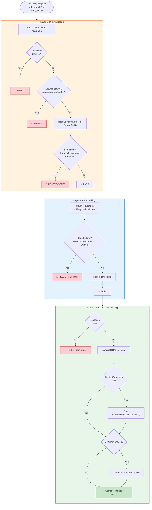

### 6.2 Threat Model

**Threat 1: SSRF (Server-Side Request Forgery)**

Attack Pattern:
```
Agent (controlled by attacker) calls: web_fetch("http://127.0.0.1:8080/admin")
                                        │
                                        ▼
                        Requests internal service API
                                        │
                                        ▼
                        Exfiltrates internal data
```

Mitigation:
- Resolve all hostnames to IPs
- Block RFC 1918 private IPs (10.0.0.0/8, 172.16.0.0/12, 192.168.0.0/16)
- Block loopback (127.0.0.0/8)
- Block IPv6 loopback (::1)
- Block link-local (169.254.0.0/16)

**Threat 2: Rate Limit Abuse**

Attack Pattern:
```
Agent makes 1000s of web_search calls
                    │
                    ▼
Exhausts search provider quota
                    │
                    ▼
Blocks legitimate usage, high API costs
```

Mitigation:
- Track requests per minute (configurable)
- Return error with retry-after when limit hit
- Separate limits for search (stricter) vs fetch (more lenient)

**Threat 3: Sensitive Data Leakage**

Mitigation:
- Cache is per-session (not persistent)
- ContentProcessor can filter sensitive patterns
- Users can disable caching via WebContext (cache_ttl=0)

**Threat 4: Credential Theft via Redirect**

Attack Pattern:
```
Fetch https://github.com → Redirects to https://attacker.com?token=xxx
```

Mitigation:
- Follow redirects internally (httpx `follow_redirects=True`), but detect cross-host redirects
- If final host differs from original host, flag in output instead of returning content
- Agent must explicitly fetch the redirect target URL (returned in the flag message)
- Log all redirects for audit

Note: httpx follows same-host redirects transparently. Cross-host redirects are detected
*after* following, then flagged to the agent. This is the practical approach — blocking all
cross-host redirects would break many legitimate URLs (e.g., URL shorteners, CDN redirects).

### 6.3 WebContext — Unified Configuration

**File:** `rawagents/tools/builtin/web/_context.py`

This is the **single unified configuration object** for all web operations. It follows the same pattern as `SecurityContext` (fs module) and `ShellSecurityContext` (shell module) — one dataclass that holds security rules, runtime config, and operational state together.

```python
"""Unified context for web tools.

This module provides the single configuration object for all web operations,
combining security settings, provider configuration, and runtime options.

PATTERN: Follows the same single-context pattern as:
  - fs/_security.py → SecurityContext
  - shell/_security.py → ShellSecurityContext

Both fs and shell use ONE unified context object (not separate security + config).
WebContext follows the same design.

Example (zero-config):
    # Just set BRAVE_API_KEY env var, tools auto-create WebContext
    results = await web_search(query="python asyncio")

Example (explicit config):
    from rawagents.tools.builtin.web import WebContext, set_web_context
    ctx = WebContext(
        allowed_domains=["docs.python.org", "github.com"],
        max_requests_per_minute=20,
    )
    set_web_context(ctx)
"""

from __future__ import annotations

import asyncio
import contextvars
import ipaddress
import os
import socket
import warnings
from collections import defaultdict
from dataclasses import dataclass, field
from datetime import datetime, timedelta, timezone
from typing import Optional, TYPE_CHECKING
from urllib.parse import urlparse

if TYPE_CHECKING:
    from ._types import SearchProvider, ContentProcessor


# ──────────────────────────────────────────────────────────────
# Error Classes
# ──────────────────────────────────────────────────────────────

class WebSecurityError(PermissionError):
    """Raised when a web operation violates security constraints.

    Attributes:
        message: Human-readable error message.
        url: The URL that was rejected (if applicable).
        reason: Specific reason for rejection.
    """

    def __init__(
        self,
        message: str,
        url: Optional[str] = None,
        reason: Optional[str] = None,
    ):
        super().__init__(message)
        self.url = url
        self.reason = reason


class URLValidationError(WebSecurityError):
    """Raised when URL validation fails."""
    pass


class SSRFError(WebSecurityError):
    """Raised when SSRF attack is detected."""
    pass


class RateLimitExceededError(WebSecurityError):
    """Raised when rate limit is exceeded."""
    pass


# ──────────────────────────────────────────────────────────────
# WebContext — Single Unified Configuration
# ──────────────────────────────────────────────────────────────

@dataclass
class WebContext:
    """Unified context for all web operations.

    Combines security settings, provider config, and runtime options
    in a single object — matching the pattern used by SecurityContext
    (fs module) and ShellSecurityContext (shell module).

    Fields are grouped into logical sections:
    - Domain filtering (allowlist, blocklist)
    - Network restrictions (SSRF prevention)
    - Response limits (size, truncation)
    - Timeouts
    - Rate limiting
    - Search provider
    - Content processing
    - Caching
    - HTTP client settings
    """

    # ── Domain Filtering ──────────────────────────────────────

    allowed_domains: list[str] = field(default_factory=list)
    """If non-empty, only allow requests to these domains."""

    blocked_domains: list[str] = field(default_factory=list)
    """Domains that are always blocked (e.g., internal networks)."""

    # ── Network Restrictions (SSRF Prevention) ────────────────

    allow_localhost: bool = False
    """Whether to allow localhost (127.0.0.1, ::1)."""

    allow_private_ips: bool = False
    """Whether to allow RFC 1918 private IPs (10.x, 172.16.x, 192.168.x)."""

    # ── Response Limits ───────────────────────────────────────

    max_response_bytes: int = 5 * 1024 * 1024  # 5MB
    """Maximum HTTP response size before rejecting."""

    max_content_chars: int = 100_000  # 100K characters
    """Maximum text content to return (for truncation)."""

    # ── Timeouts ──────────────────────────────────────────────

    default_timeout: int = 30  # seconds
    """Default request timeout."""

    max_timeout: int = 120  # seconds
    """Maximum allowed request timeout."""

    # ── Rate Limiting ─────────────────────────────────────────

    max_requests_per_minute: int = 30
    """Maximum web requests (fetch) per minute."""

    max_search_per_minute: int = 10
    """Maximum search requests per minute (more restrictive)."""

    # ── Search Provider ───────────────────────────────────────

    search_provider: Optional[SearchProvider] = None
    """The SearchProvider instance. If None, auto-creates BraveSearchProvider
    from BRAVE_API_KEY env var at first search call."""

    # ── Content Processing ────────────────────────────────────

    content_processor: Optional[ContentProcessor] = None
    """Optional processor applied to fetched content before returning
    to the agent. See Section 7 of PRD for ContentProcessor documentation.

    Example: Claude Code-style Haiku extraction, trust checking, filtering.
    Default: None (content returned as-is after conversion)."""

    # ── Caching ───────────────────────────────────────────────

    cache_ttl: int = 900  # 15 minutes
    """Cache time-to-live in seconds. Set to 0 to disable caching."""

    cache_max_size: int = 128
    """Maximum number of URLs to keep in cache (LRU eviction)."""

    # ── HTTP Client Settings ──────────────────────────────────

    user_agent: str = "RawAgents/1.0 (+https://github.com/tawab-safi/rawagents)"
    """User-Agent header for HTTP requests."""

    max_retries: int = 2
    """Number of retries for failed requests."""

    retry_on_cloudflare: bool = True
    """Whether to retry with simplified UA when Cloudflare blocks (403 + cf-mitigated)."""

    # ── Internal State (not set by user) ──────────────────────

    _request_times: dict[str, list[datetime]] = field(
        default_factory=lambda: defaultdict(list)
    )
    """Track request timestamps for rate limiting."""

    # ── Initialization ────────────────────────────────────────

    def __post_init__(self):
        """Normalize domain lists."""
        self.allowed_domains = [d.lower().strip() for d in self.allowed_domains]
        self.blocked_domains = [d.lower().strip() for d in self.blocked_domains]

    # ── URL Validation ────────────────────────────────────────

    async def validate_url(self, url: str) -> tuple[str, str]:
        """Validate URL and return (normalized_url, hostname).

        This method is async because hostname resolution (SSRF check)
        uses asyncio.to_thread() to avoid blocking the event loop.

        Args:
            url: The URL to validate.

        Returns:
            Tuple of (normalized_url, hostname).

        Raises:
            URLValidationError: If URL is invalid.
            SSRFError: If SSRF attempt detected.
        """
        # Parse URL
        try:
            parsed = urlparse(url)
        except Exception as e:
            raise URLValidationError(
                f"Error: Invalid URL: {e}",
                url=url,
                reason="URL parsing failed"
            )

        # Validate scheme
        if parsed.scheme not in ("http", "https"):
            raise URLValidationError(
                "Error: URL must start with http:// or https://",
                url=url,
                reason="Invalid scheme"
            )

        # Extract hostname
        hostname = parsed.hostname
        if not hostname:
            raise URLValidationError(
                "Error: Invalid URL: missing hostname",
                url=url,
                reason="No hostname in URL"
            )

        # Domain blocklist check (before DNS resolution)
        hostname_lower = hostname.lower()
        if self._is_domain_blocked(hostname_lower):
            raise URLValidationError(
                f"Error: Domain '{hostname}' is blocked",
                url=url,
                reason="Domain in blocklist"
            )

        # Domain allowlist check (before DNS resolution)
        if self.allowed_domains and not self._is_domain_allowed(hostname_lower):
            raise URLValidationError(
                f"Error: Domain '{hostname}' is not in allowed list",
                url=url,
                reason="Domain not in allowlist"
            )

        # Resolve hostname to IP (for SSRF prevention, async-safe)
        try:
            ip = await self._resolve_hostname(hostname)
        except Exception:
            if hostname in ("localhost", "127.0.0.1", "::1"):
                raise SSRFError(
                    "Error: Cannot fetch localhost addresses",
                    url=url,
                    reason="Localhost is blocked"
                )
            raise URLValidationError(
                f"Error: Failed to resolve hostname: {hostname}",
                url=url,
                reason="DNS resolution failed"
            )

        # SSRF check: block private IPs
        if not self._is_ip_allowed(ip):
            raise SSRFError(
                f"Error: Cannot fetch private/internal URLs (resolved to {ip})",
                url=url,
                reason="Private IP address"
            )

        return url, hostname

    def check_rate_limit(self, operation: str = "fetch") -> None:
        """Check rate limit for an operation.

        Args:
            operation: Either "fetch" or "search".

        Raises:
            RateLimitExceededError: If rate limit exceeded.
        """
        now = datetime.now(timezone.utc)
        one_minute_ago = now - timedelta(minutes=1)

        limit = (
            self.max_search_per_minute if operation == "search"
            else self.max_requests_per_minute
        )

        # Clean up old entries
        self._request_times[operation] = [
            t for t in self._request_times[operation]
            if t > one_minute_ago
        ]

        # Check limit
        if len(self._request_times[operation]) >= limit:
            raise RateLimitExceededError(
                f"Error: {operation.capitalize()} rate limit exceeded. "
                f"Max {limit} per minute.",
                reason="Rate limit exceeded"
            )

        # Record this request
        self._request_times[operation].append(now)

    # ── Private Helpers ───────────────────────────────────────

    def _is_domain_blocked(self, domain: str) -> bool:
        """Check if domain is in blocklist.

        Uses exact match or subdomain suffix match (NOT substring).
        Blocking "example.com" blocks "example.com" and "sub.example.com"
        but NOT "not-example.com" or "myexample.com".
        """
        domain_lower = domain.lower()
        for blocked in self.blocked_domains:
            if domain_lower == blocked or domain_lower.endswith("." + blocked):
                return True
        return False

    def _is_domain_allowed(self, domain: str) -> bool:
        """Check if domain is in allowlist.

        Uses exact match or subdomain suffix match (NOT substring).
        Allowing "example.com" allows "example.com" and "sub.example.com"
        but NOT "not-example.com" or "myexample.com".
        """
        if not self.allowed_domains:
            return True
        domain_lower = domain.lower()
        for allowed in self.allowed_domains:
            if domain_lower == allowed or domain_lower.endswith("." + allowed):
                return True
        return False

    async def _resolve_hostname(self, hostname: str) -> str:
        """Resolve hostname to IP address (async-safe).

        Uses asyncio.to_thread() to avoid blocking the event loop
        during DNS resolution.
        """
        def _sync_resolve() -> str:
            try:
                return socket.gethostbyname(hostname)
            except socket.gaierror:
                return socket.getaddrinfo(hostname, None)[0][4][0]

        return await asyncio.to_thread(_sync_resolve)

    def _is_ip_allowed(self, ip: str) -> bool:
        """Check if IP address is allowed."""
        try:
            addr = ipaddress.ip_address(ip)
        except ValueError:
            return False

        if not self.allow_localhost and addr.is_loopback:
            return False
        if not self.allow_private_ips and addr.is_private:
            return False
        if addr.is_link_local:
            return False
        if addr.is_reserved:
            return False

        return True


# ──────────────────────────────────────────────────────────────
# Context Variable Management
# ──────────────────────────────────────────────────────────────

_web_context: contextvars.ContextVar[Optional[WebContext]] = (
    contextvars.ContextVar("web_context", default=None)
)


def get_web_context(allow_permissive: bool = True) -> WebContext:
    """Get the current WebContext from context vars.

    Follows the same pattern as fs.get_security_context() and
    shell.get_shell_security_context().

    Args:
        allow_permissive: If True (default), returns a permissive default
            context when none is set. If False, raises an error.
            Set to False in production to enforce explicit configuration.

    Returns:
        The current WebContext.

    Raises:
        WebSecurityError: If allow_permissive=False and no context is set.
    """
    ctx = _web_context.get(None)
    if ctx is None:
        if not allow_permissive:
            raise WebSecurityError(
                "No WebContext set. Call set_web_context() before using web tools.",
                reason="No context configured",
            )
        warnings.warn(
            "No WebContext set. Using permissive defaults. "
            "Call set_web_context() for production use.",
            RuntimeWarning,
            stacklevel=2,
        )
        return WebContext()
    return ctx


def set_web_context(ctx: WebContext) -> None:
    """Set the WebContext in context vars.

    Args:
        ctx: The WebContext to set.
    """
    _web_context.set(ctx)
```

#### WebContext Class Diagram

This diagram shows the internal structure of `WebContext` and how it connects to the Protocols and tools:

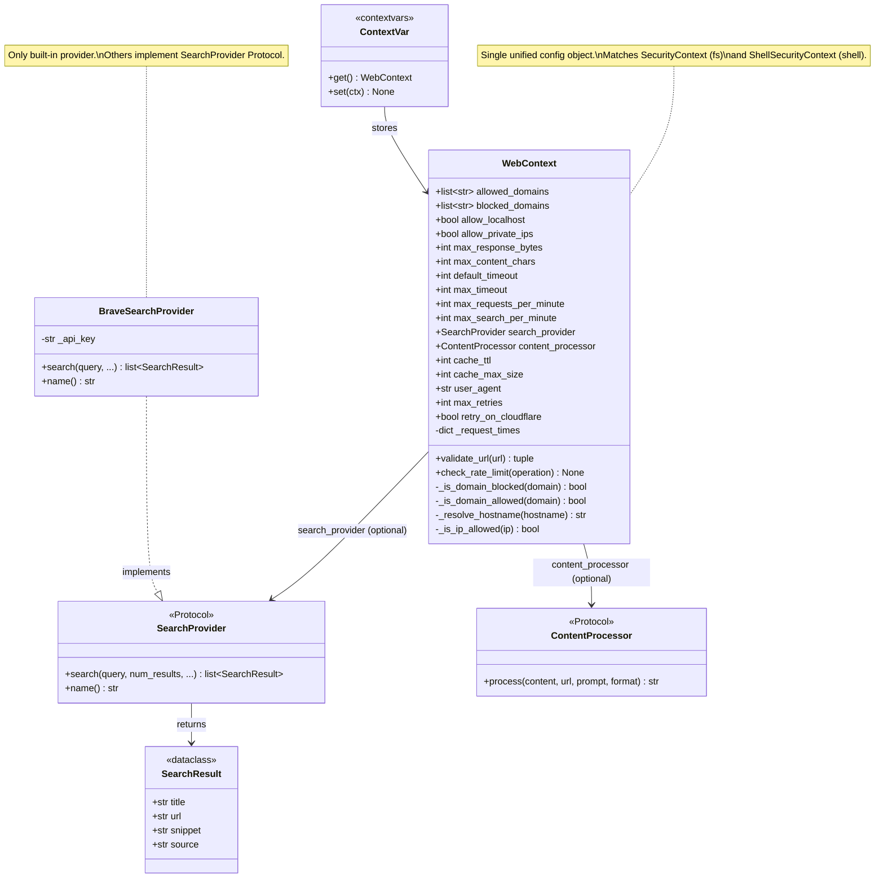

### 6.4 SSRF Prevention Details

#### Private IP Ranges Blocked

- **IPv4 Loopback**: 127.0.0.0/8 (127.0.0.1)
- **RFC 1918 Private**: 10.0.0.0/8, 172.16.0.0/12, 192.168.0.0/16
- **IPv6 Loopback**: ::1/128
- **IPv6 Link-Local**: fe80::/10
- **IPv6 Unique Local**: fc00::/7

#### Cloud Metadata Endpoints (blocked by default)

```
- http://169.254.169.254/    (AWS EC2 metadata — link-local)
- http://metadata.google.internal/  (GCP — resolves to private IP)
- http://169.254.165.254/    (Azure metadata — link-local)
```

#### SSRF Prevention Decision Flow

This diagram shows exactly how `_is_ip_allowed()` evaluates a resolved IP address:

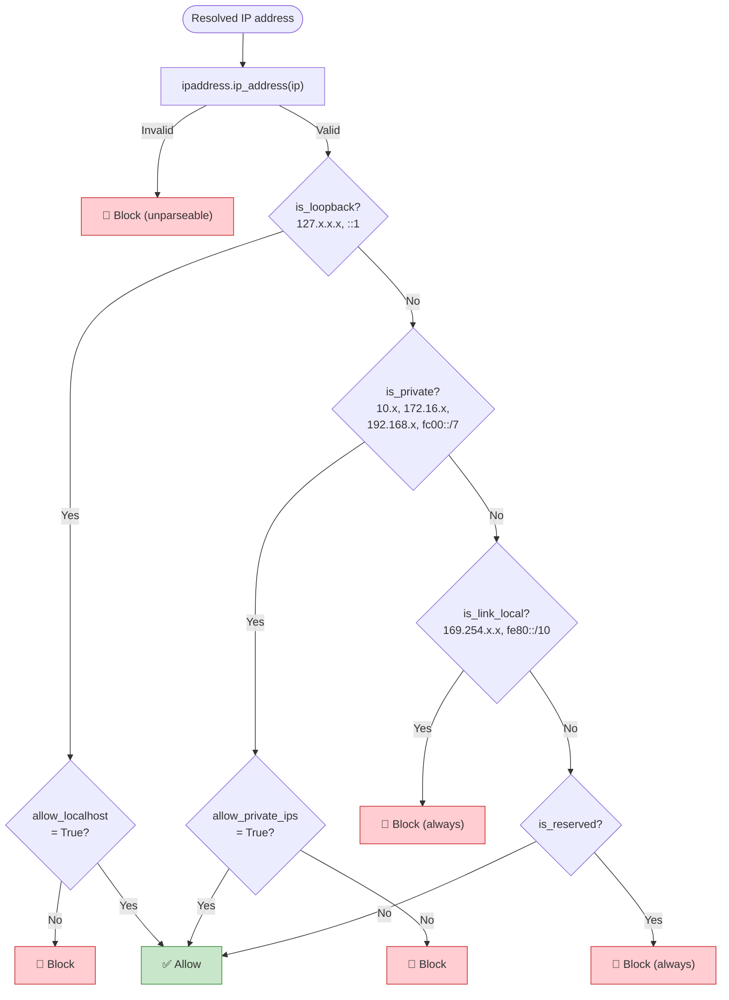

### 6.5 Known Security Limitations (v1)

The following are **known limitations** of the v1 SSRF prevention model. They are documented here for transparency and are acceptable trade-offs for v1 given the added implementation complexity of full mitigation. Each includes a recommended v2 fix.

#### 6.5.1 DNS Rebinding / TOCTOU Vulnerability

**Severity:** HIGH (documented, accepted for v1)

**Description:** The SSRF prevention resolves DNS once via `_resolve_hostname()` to check the IP, then passes the *original URL string* to httpx, which performs its own DNS resolution when connecting. An attacker can exploit this Time-Of-Check to Time-Of-Use (TOCTOU) gap with DNS rebinding:

1. Attacker configures their domain with a 0-second DNS TTL
2. First DNS lookup (security check) returns a public IP → passes validation
3. Second DNS lookup (httpx connect) returns `127.0.0.1` → bypasses check
4. The time gap between `_resolve_hostname()` and `httpx.get()` is the race window

**Reference:** This is the same vulnerability class as [AutoGPT CVE-2025-31490](https://github.com/Significant-Gravitas/AutoGPT/security/advisories/GHSA-wvjg-9879-3m7w).

**Mitigation for v1:** The risk is partially mitigated by:
- Most DNS resolvers cache results (attacker needs 0-TTL DNS)
- `allow_private_ips=False` (default) means the attacker needs precise timing
- Agents typically run in environments where internal services aren't high-value targets

**Fix for v2 (TODO):** Resolve DNS once, then connect to the validated IP directly by setting `extensions={"sni_hostname": hostname}` in httpx or using a custom transport that pins the resolved IP. This eliminates the TOCTOU gap entirely.

```python
# v2 approach: DNS pinning (pseudocode)
ip = await self._resolve_hostname(hostname)
self._check_ip(ip)  # SSRF check
# Connect to the VALIDATED IP, not the hostname
response = await client.get(
    url.replace(hostname, ip),
    headers={"Host": hostname},
    extensions={"sni_hostname": hostname},
)
```

#### 6.5.2 Redirect Chain SSRF Bypass

**Severity:** MEDIUM (documented, accepted for v1)

**Description:** SSRF checks (Layer 1) apply only to the **initial URL**. httpx follows up to 5 redirect hops internally. An attacker could craft a redirect chain where an intermediate hop targets a private IP:

```
public.com → public.com/redir → http://10.0.0.1/admin → public.com/result
```

The initial URL (`public.com`) passes validation, but the intermediate hop to `10.0.0.1` is followed by httpx without SSRF checking.

**Mitigation for v1:** The risk is partially mitigated by:
- Cross-host redirects to the *final* URL are detected and flagged
- Most real-world redirect chains don't target private IPs
- The attacker needs to control the initial server to craft redirects

**Fix for v2 (TODO):** Use `follow_redirects=False` in httpx and manually follow redirects, validating each hop's URL through `WebContext.validate_url()` before following:

```python
# v2 approach: per-hop validation (pseudocode)
for hop in range(max_redirects):
    response = await client.get(url, follow_redirects=False)
    if response.is_redirect:
        redirect_url = str(response.next_request.url)
        await ctx.validate_url(redirect_url)  # SSRF check on each hop
        url = redirect_url
    else:
        break
```

### 6.6 Domain Filtering

#### Allowlist Mode

```python
ctx = WebContext(
    allowed_domains=["docs.python.org", "github.com", "readthedocs.io"]
)
set_web_context(ctx)

# Allowed: docs.python.org, github.com, readthedocs.io
# Blocked: everything else
```

#### Blocklist Mode

```python
ctx = WebContext(
    blocked_domains=["pinterest.com", "twitter.com"]
)
set_web_context(ctx)

# Blocked: pinterest.com, twitter.com (including subdomains)
# Allowed: everything else
```

### 6.7 Rate Limiting Strategy

```python
ctx = WebContext(
    max_requests_per_minute=30,    # For web_fetch
    max_search_per_minute=10,      # For web_search (more restrictive)
)
```

Rate limits are tracked **per WebContext instance**. Each context has its own request counter. If multiple async tasks share the same context (via contextvars), they share rate limits.

---

## 7. Content Processing (Extensibility)

This section describes the **ContentProcessor Protocol** — the first-class extensibility hook for post-fetch processing. This is how users add custom behavior like Claude Code-style extraction, trust checking, or content filtering to `web_fetch` without modifying any RawAgents code.

### 7.1 Why ContentProcessor Exists

Claude Code uses a secondary Haiku 4.5 conversation to extract key information from fetched pages for non-trusted sites. This is powerful but proprietary. Rather than building this in, RawAgents provides the `ContentProcessor` Protocol — a clean interface that lets users implement *any* post-fetch processing they want.

**What you can build with ContentProcessor:**
- Claude Code-style Haiku extraction (use a small model to summarize content)
- Trusted site bypass (skip processing for known-safe domains like docs.python.org)
- Sensitive data filtering (strip API keys, passwords before returning to agent)
- Content quality scoring (rank content relevance before returning)
- Custom summarization (domain-specific extraction logic)

### 7.2 ContentProcessor Protocol

**File:** `rawagents/tools/builtin/web/_types.py`

```python
@runtime_checkable
class ContentProcessor(Protocol):
    """Protocol for optional post-fetch content processing.

    Implement this to add custom processing to web_fetch results.
    The processor runs AFTER HTML→Markdown conversion but BEFORE
    content truncation.

    When to implement:
    - You want Claude Code-style extraction (use Haiku to summarize)
    - You want to filter sensitive data from fetched content
    - You want domain-specific processing rules
    - You want trusted site bypass (return content as-is for known sites)

    Pipeline:
        HTTP fetch → HTML conversion → **ContentProcessor** → Truncation → Return

    Example:
        class MyProcessor:
            async def process(self, content, url, prompt, format):
                if "docs.python.org" in url:
                    return content  # Trusted — skip processing
                # Use Claude to extract key info
                return await extract_with_haiku(content, prompt)

        ctx = WebContext(content_processor=MyProcessor())
        set_web_context(ctx)
    """

    async def process(
        self,
        content: str,
        url: str,
        prompt: str,
        format: str,
    ) -> str:
        """Process fetched content before returning to the agent.

        Args:
            content: The fetched content (already converted to requested format).
            url: The URL that was fetched.
            prompt: The extraction prompt/context from web_fetch call.
            format: The output format ("markdown", "text", or "html").

        Returns:
            Processed content string.
        """
        ...
```

### 7.3 Example: Claude Code-Style Haiku Extraction

This example shows how to implement the same extraction pattern Claude Code uses — a secondary LLM call to extract key information. This is **not built into RawAgents**, but takes ~25 lines to implement:

```python
from rawagents.tools.builtin.web import WebContext, set_web_context

class HaikuExtractionProcessor:
    """Extract key information using Claude Haiku.

    Matches Claude Code's pattern: for non-trusted sites, use a small
    fast model to extract the most relevant content before returning
    to the main agent.
    """

    TRUSTED_DOMAINS = {"docs.python.org", "github.com", "readthedocs.io"}

    async def process(self, content: str, url: str, prompt: str, format: str) -> str:
        # Skip processing for trusted domains
        from urllib.parse import urlparse
        domain = urlparse(url).hostname or ""
        if any(domain == trusted or domain.endswith("." + trusted) for trusted in self.TRUSTED_DOMAINS):
            return content

        # No prompt = no extraction needed
        if not prompt:
            return content

        # Use Haiku to extract relevant content
        import anthropic
        client = anthropic.AsyncAnthropic()
        response = await client.messages.create(
            model="claude-3-5-haiku-20241022",
            max_tokens=2000,
            messages=[{
                "role": "user",
                "content": (
                    f"Extract the key information relevant to this question "
                    f"from the web page content below.\n\n"
                    f"Question: {prompt}\n\n"
                    f"Content:\n{content[:50000]}"
                ),
            }],
        )
        return response.content[0].text

# Use it
ctx = WebContext(content_processor=HaikuExtractionProcessor())
set_web_context(ctx)

# Now web_fetch will extract key info automatically
content = await web_fetch(
    url="https://example.com/long-article",
    prompt="What are the main features?"
)
```

### 7.4 Example: Simple Sensitive Data Filter

```python
import re

class SensitiveDataFilter:
    """Strip potential secrets from fetched content."""

    PATTERNS = [
        r'[A-Za-z0-9+/]{40,}={0,2}',     # Base64 tokens
        r'sk-[A-Za-z0-9]{20,}',            # API keys
        r'ghp_[A-Za-z0-9]{36}',            # GitHub tokens
        r'password\s*[:=]\s*\S+',           # Password assignments
    ]

    async def process(self, content: str, url: str, prompt: str, format: str) -> str:
        for pattern in self.PATTERNS:
            content = re.sub(pattern, '[REDACTED]', content)
        return content
```

### 7.5 When ContentProcessor Runs

```
web_fetch("https://example.com", prompt="What are the features?")
    │
    ├── 1. URL Validation (WebContext.validate_url)
    ├── 2. Rate Limit Check (WebContext.check_rate_limit)
    ├── 3. Cache Check (AsyncTTLCache.get_or_wait)
    │       └── Cache HIT → skip to step 7
    ├── 4. HTTP Fetch (httpx)
    ├── 5. HTML→Markdown Conversion (markdownify)
    ├── 6. Cache Store (AsyncTTLCache.set)
    ├── 7. ★ ContentProcessor.process() ★    ← runs HERE
    ├── 8. Content Truncation (100KB limit)
    └── 9. Return to agent
```

Note: The processor runs **after caching** so that the raw content is cached (not the processed version). This means different prompts against the same URL produce different processed outputs from the same cached content.

The following sequence diagram shows this interaction between components (cache miss path):

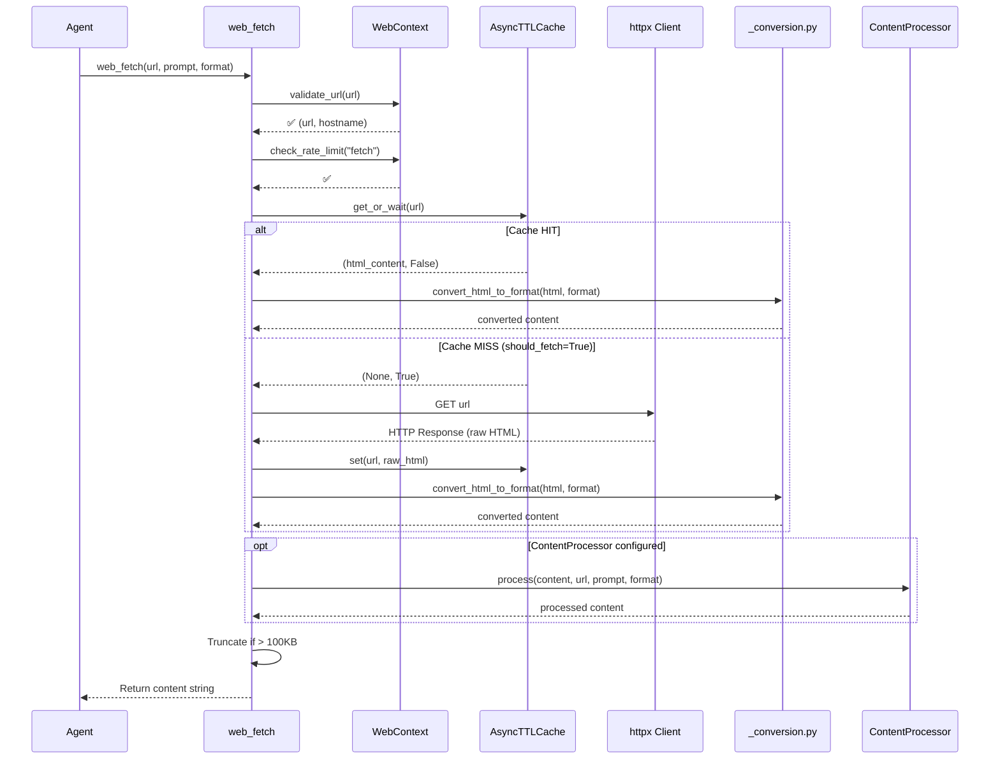

The key insight: **raw HTML is cached, not converted content**. This allows the same cached page to be converted to different formats (markdown, text, html) and processed with different prompts without re-fetching.

---

## 8. Implementation Approach

### 8.1 Architecture Overview

```
┌─────────────────────────────────────────────────────────────────┐
│                      web_search (tool)                           │
│  Dispatches to search provider (Brave default, or custom)        │
└─────────────────────────────────────────────────────────────────┘
                              │
                ┌─────────────┼─────────────┐
                ▼             ▼             ▼
         BraveSearchProvider   (User's custom provider)
              (built-in)          │
                  │               └── Implements SearchProvider Protocol
                  │
                  └── SearchProvider Protocol
```

```
┌─────────────────────────────────────────────────────────────────┐
│                      web_fetch (tool)                            │
│  Simple: fetch → convert → (optional process) → return           │
└─────────────────────────────────────────────────────────────────┘
                              │
                ┌─────────────┴─────────────┐
                ▼                           ▼
         URL Validation              HTTP Fetch (httpx)
         (WebContext)                + HTML Conversion
                │                   (markdownify)
                │                          │
                └──────────┬───────────────┘
                           ▼
                    ContentProcessor
                    (Optional, user-provided)
                           │
                           ▼
                    Content Truncation → Return
```

The following diagrams show the same architecture with more detail on how the provider plug-in model works and how web_fetch orchestrates its pipeline:

**SearchProvider Plug-in Architecture:**

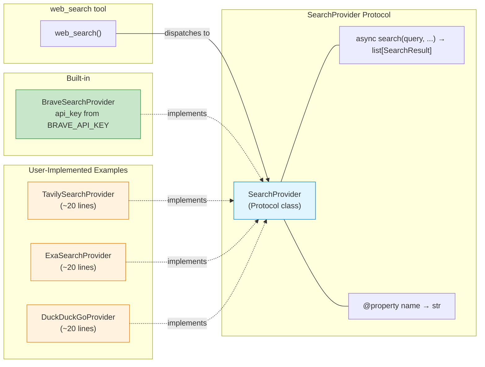

**web_fetch Pipeline Architecture:**

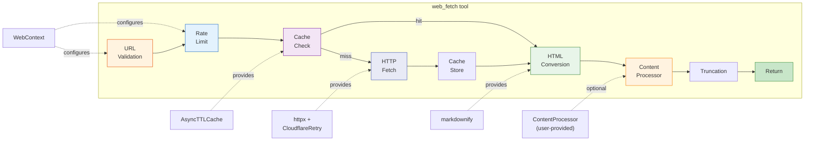

### 8.2 SearchProvider Protocol

**File:** `rawagents/tools/builtin/web/_types.py`

```python
"""Type definitions for web tools.

This module defines the pluggable protocols that users can implement
to customize web search and content processing.
"""

from __future__ import annotations

from dataclasses import dataclass
from typing import Protocol, runtime_checkable


@runtime_checkable
class SearchProvider(Protocol):
    """Protocol for pluggable search backends.

    Brave is shipped built-in. Users implement this Protocol to add
    custom providers (Tavily, Exa, Google, DuckDuckGo, etc.) in ~20 lines.

    Example:
        class TavilySearchProvider:
            def __init__(self, api_key: str):
                self._api_key = api_key

            async def search(
                self,
                query: str,
                *,
                num_results: int = 10,
                allowed_domains: list[str] | None = None,
                blocked_domains: list[str] | None = None,
            ) -> list[SearchResult]:
                import httpx
                async with httpx.AsyncClient() as client:
                    response = await client.post(
                        "https://api.tavily.com/search",
                        json={"query": query, "max_results": num_results, ...},
                        headers={"Authorization": f"Bearer {self._api_key}"},
                    )
                    data = response.json()
                    return [
                        SearchResult(title=r["title"], url=r["url"],
                                     snippet=r["content"], source="tavily")
                        for r in data["results"]
                    ]

            @property
            def name(self) -> str:
                return "tavily"
    """

    async def search(
        self,
        query: str,
        *,
        num_results: int = 10,
        allowed_domains: list[str] | None = None,
        blocked_domains: list[str] | None = None,
    ) -> list[SearchResult]:
        """Execute a web search.

        Args:
            query: The search query.
            num_results: Number of results to return (default 10, max 20).
            allowed_domains: If set, only return results from these domains.
            blocked_domains: If set, exclude results from these domains.

        Returns:
            List of SearchResult objects.

        Raises:
            SearchError: If the search fails.
        """
        ...

    @property
    def name(self) -> str:
        """Provider name for logging/identification."""
        ...


@dataclass
class SearchResult:
    """A single search result."""
    title: str
    url: str
    snippet: str
    source: str


class SearchError(Exception):
    """Raised when search provider returns an error."""
    pass


class FetchError(Exception):
    """Raised when web fetch fails."""
    pass
```

### 8.3 BraveSearchProvider (Built-in Default)

**File:** `rawagents/tools/builtin/web/providers/brave.py`

```python
"""Brave Search provider — the built-in default.

Brave Search is the default provider, matching what Claude Code uses
under the hood. Free tier: 2,000 searches/month.

Requires: BRAVE_API_KEY environment variable
"""

from __future__ import annotations

import os
from typing import Optional

from .._types import SearchProvider, SearchResult, SearchError


class BraveSearchProvider:
    """Brave Search API provider.

    This is the only built-in provider. For other providers (Tavily, Exa,
    Google, etc.), implement the SearchProvider Protocol — see _types.py
    docstring for a complete example.

    Args:
        api_key: Brave Search API key. Defaults to BRAVE_API_KEY env var.

    Example:
        # Auto-created from env var (typical usage):
        provider = BraveSearchProvider()

        # Explicit API key:
        provider = BraveSearchProvider(api_key="BSA-xxxxx")
    """

    def __init__(self, api_key: Optional[str] = None):
        self._api_key = api_key or os.environ.get("BRAVE_API_KEY")
        if not self._api_key:
            raise SearchError(
                "BRAVE_API_KEY not set. Get a free key at "
                "https://brave.com/search/api/"
            )

    @property
    def name(self) -> str:
        return "brave"

    async def search(
        self,
        query: str,
        *,
        num_results: int = 10,
        allowed_domains: list[str] | None = None,
        blocked_domains: list[str] | None = None,
    ) -> list[SearchResult]:
        """Execute web search via Brave Search API."""
        import httpx

        try:
            async with httpx.AsyncClient() as client:
                response = await client.get(
                    "https://api.search.brave.com/res/v1/web/search",
                    params={
                        "q": query,
                        "count": min(num_results, 20),
                    },
                    headers={
                        "X-Subscription-Token": self._api_key,
                        "Accept": "application/json",
                    },
                    timeout=15.0,
                )
                response.raise_for_status()
                data = response.json()
        except httpx.HTTPStatusError as e:
            raise SearchError(
                f"Brave Search API error: HTTP {e.response.status_code}"
            ) from e
        except httpx.RequestError as e:
            raise SearchError(f"Brave Search request failed: {e}") from e

        # Parse results
        results: list[SearchResult] = []
        for item in data.get("web", {}).get("results", []):
            url = item.get("url", "")
            domain = _extract_domain(url)

            # Apply domain filtering
            if allowed_domains and not _domain_matches(domain, allowed_domains):
                continue
            if blocked_domains and _domain_matches(domain, blocked_domains):
                continue

            results.append(SearchResult(
                title=item.get("title", ""),
                url=url,
                snippet=item.get("description", ""),
                source="brave",
            ))

        return results[:num_results]


def _extract_domain(url: str) -> str:
    """Extract domain from URL."""
    from urllib.parse import urlparse
    return urlparse(url).hostname or ""


def _domain_matches(domain: str, domain_list: list[str]) -> bool:
    """Check if domain matches any entry in list (exact or subdomain).

    Uses exact match or subdomain suffix — NOT substring.
    "example.com" matches "example.com" and "sub.example.com"
    but NOT "not-example.com" or "myexample.com".
    """
    domain_lower = domain.lower()
    return any(
        domain_lower == d.lower() or domain_lower.endswith("." + d.lower())
        for d in domain_list
    )
```

### 8.4 Content Conversion

**File:** `rawagents/tools/builtin/web/_conversion.py`

```python
"""HTML to Markdown/Text conversion.

Uses markdownify (Python equivalent of Turndown.js used by Claude Code and OpenCode).
"""

from __future__ import annotations

from typing import Literal


async def convert_html_to_format(
    html: str,
    format: Literal["markdown", "text", "html"],
) -> str:
    """Convert HTML to the desired format."""
    if format == "html":
        return html

    if format == "markdown":
        from markdownify import markdownify as md
        content = md(
            html,
            heading_style="ATX",
            strip=["script", "style", "meta", "link"],
        )
        return content.strip()

    if format == "text":
        import re
        import html as html_module
        text = re.sub(r'<script[^>]*>.*?</script>', '', html, flags=re.DOTALL | re.IGNORECASE)
        text = re.sub(r'<style[^>]*>.*?</style>', '', text, flags=re.DOTALL | re.IGNORECASE)
        text = re.sub(r'<[^>]+>', '', text)
        text = html_module.unescape(text)
        text = re.sub(r'\s+', ' ', text)
        return text.strip()

    raise ValueError(f"Unknown format: {format}")
```

### 8.5 HTTP Client

**File:** `rawagents/tools/builtin/web/_http.py`

```python
"""Shared HTTP client with Cloudflare retry logic.

Matches OpenCode's approach: retry with simplified UA on Cloudflare 403.
"""

from __future__ import annotations

import httpx
from typing import Optional


class CloudflareRetryTransport(httpx.AsyncHTTPTransport):
    """Retries with simplified UA on Cloudflare 403 + cf-mitigated header."""

    async def handle_async_request(self, request: httpx.Request) -> httpx.Response:
        response = await super().handle_async_request(request)

        if (
            response.status_code == 403
            and "cf-mitigated" in response.headers
        ):
            request.headers["user-agent"] = "RawAgents/1.0"
            response = await super().handle_async_request(request)

        return response


# Module-level shared client for connection pooling
_http_client: Optional[httpx.AsyncClient] = None


async def get_http_client(
    user_agent: str = "RawAgents/1.0 (+https://github.com/tawab-safi/rawagents)",
    timeout: int = 30,
) -> httpx.AsyncClient:
    """Get or create shared async HTTP client."""
    global _http_client
    if _http_client is None or _http_client.is_closed:
        transport = CloudflareRetryTransport()
        _http_client = httpx.AsyncClient(
            transport=transport,
            timeout=timeout,
            follow_redirects=True,
            headers={"user-agent": user_agent},
        )
    return _http_client
```

### 8.6 Caching Strategy

**Cache Lifecycle:** The `AsyncTTLCache` is a **module-level singleton** (like `ProcessManager` in the shell module). It is created lazily on first `web_fetch` call and shared across all `WebContext` instances. The singleton uses the `cache_ttl` and `cache_max_size` from the *active* `WebContext` at creation time.

```python
# Module-level singleton (in web_fetch.py)
_url_cache: Optional[AsyncTTLCache] = None

def _get_cache(ctx: WebContext) -> AsyncTTLCache:
    """Get or create the module-level URL cache singleton."""
    global _url_cache
    if _url_cache is None:
        _url_cache = AsyncTTLCache(
            max_size=ctx.cache_max_size,
            ttl=ctx.cache_ttl,
        )
    return _url_cache
```

**Rationale:** A module-level singleton is more efficient (fewer duplicate fetches when agents use multiple contexts) and matches the shell module's `ProcessManager` pattern. The cache is per-session (not persistent) — it lives only as long as the Python process.

**File:** `rawagents/tools/builtin/web/_cache.py`

```python
"""URL response caching with TTL and thundering herd prevention."""

from __future__ import annotations

import asyncio
from dataclasses import dataclass
from datetime import datetime, timezone
from typing import Optional


@dataclass
class CacheEntry:
    """A cache entry with TTL."""
    content: str
    timestamp: datetime
    ttl_seconds: int

    def is_expired(self) -> bool:
        if self.ttl_seconds == 0:
            return False
        elapsed = (datetime.now(timezone.utc) - self.timestamp).total_seconds()
        return elapsed > self.ttl_seconds


class AsyncTTLCache:
    """Async-safe TTL cache with thundering herd prevention.

    Concurrent requests for the same URL share a single in-flight fetch
    via asyncio.Event, preventing duplicate HTTP requests.
    """

    def __init__(self, max_size: int = 128, ttl: int = 900):
        self.max_size = max_size
        self.ttl = ttl
        self.cache: dict[str, CacheEntry] = {}
        self.lock = asyncio.Lock()
        self._in_flight: dict[str, asyncio.Event] = {}

    async def get(self, url: str) -> Optional[str]:
        """Get cached content for URL."""
        async with self.lock:
            entry = self.cache.get(url)
            if entry is None:
                return None
            if entry.is_expired():
                del self.cache[url]
                return None
            return entry.content

    async def get_or_wait(self, url: str) -> tuple[Optional[str], bool]:
        """Get cached content, or signal that caller should fetch.

        Returns:
            Tuple of (content_or_None, should_fetch).
            If should_fetch is True, caller must fetch and call set().
        """
        async with self.lock:
            entry = self.cache.get(url)
            if entry is not None and not entry.is_expired():
                return entry.content, False

            if url in self._in_flight:
                return None, False  # Another coroutine is fetching

            self._in_flight[url] = asyncio.Event()
            return None, True  # Caller should fetch

    async def wait_for_inflight(self, url: str) -> Optional[str]:
        """Wait for an in-flight fetch to complete."""
        event = self._in_flight.get(url)
        if event:
            await event.wait()
        return await self.get(url)

    async def set(self, url: str, content: str) -> None:
        """Cache content and notify waiters."""
        async with self.lock:
            if len(self.cache) >= self.max_size:
                oldest_url = min(
                    self.cache.keys(),
                    key=lambda u: self.cache[u].timestamp,
                )
                del self.cache[oldest_url]

            self.cache[url] = CacheEntry(
                content=content,
                timestamp=datetime.now(timezone.utc),
                ttl_seconds=self.ttl,
            )

            event = self._in_flight.pop(url, None)
            if event:
                event.set()

    async def cancel_inflight(self, url: str) -> None:
        """Cancel an in-flight fetch (e.g., on error)."""
        async with self.lock:
            event = self._in_flight.pop(url, None)
            if event:
                event.set()

    async def clear(self) -> None:
        """Clear all cache entries and in-flight tracking."""
        async with self.lock:
            self.cache.clear()
            for event in self._in_flight.values():
                event.set()
            self._in_flight.clear()
```

#### Thundering Herd Prevention — How It Works

When multiple concurrent requests arrive for the same URL, only one performs the actual HTTP fetch. The others wait on an `asyncio.Event` and receive the cached result:

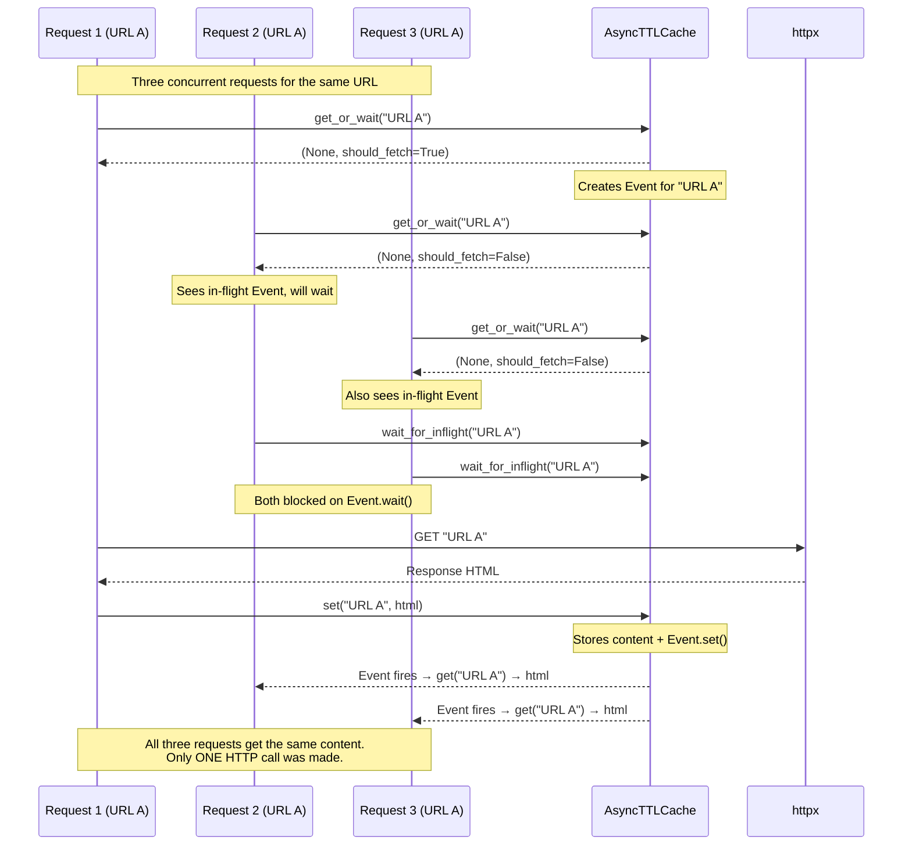

This pattern prevents N concurrent requests for the same URL from creating N duplicate HTTP calls — a common problem in agent loops where multiple tools might request the same documentation page simultaneously.

---

## 9. Reference Implementations

### 9.1 How Claude Code Does It

#### Web Search
- **Implementation**: Server-side Brave Search via Anthropic infrastructure
- **Architecture**: Two-stage process with secondary Opus conversation for ranking
- **Replicability**: NOT replicable in open-source (proprietary infrastructure)

#### Web Fetch
- **Implementation**: Client-side `fetch()` API + `Turndown.js` HTML conversion
- **Content Processing**: Secondary Haiku conversation for non-trusted sites
- **Trusted Sites**: Bypass Haiku for ~80 known-safe domains (docs, GitHub, etc.)
- **Caching**: 15-minute in-memory cache
- **Replicability**: PARTIALLY replicable — ContentProcessor Protocol enables this pattern

### 9.2 How OpenCode Does It

#### Web Search
- **Implementation**: Single HTTP POST to Exa AI MCP endpoint
- **Replicability**: SIMPLE — SearchProvider Protocol enables this pattern

#### Web Fetch
- **Implementation**: `fetch()` API + `Turndown.js` conversion
- **Output Formats**: 3 formats (markdown, text, html)
- **Size Limits**: 5MB response, 100KB text truncation
- **Cloudflare Retry**: 403 with `cf-mitigated` triggers retry with simplified UA
- **Replicability**: SIMPLE — our web_fetch matches this directly

### 9.3 Our Approach: Best of Both

**From Claude Code:** 15-minute cache, security-first, ContentProcessor hook for extraction
**From OpenCode:** Simple fetch→convert→return pipeline, Cloudflare retry, 3 output formats
**New in RawAgents:** Pluggable SearchProvider Protocol, unified WebContext, Python async-first

---

## 10. Testing Strategy

### 10.1 Unit Tests

**Web Search Tool Tests** (`tests/tools/builtin/web/test_web_search.py`)

```python
def test_web_search_valid_query():
    """Test basic search with valid query."""

def test_web_search_empty_query():
    """Test search with empty query returns error."""

def test_web_search_domain_filtering():
    """Test allowed_domains and blocked_domains."""

def test_web_search_rate_limit():
    """Test rate limiting for searches."""

def test_web_search_both_domain_lists():
    """Test error when both allowed and blocked domains specified."""

def test_web_search_provider_error():
    """Test handling of provider API errors."""

def test_web_search_no_provider_no_env():
    """Test clear error when no provider and no BRAVE_API_KEY."""
```

**Web Fetch Tool Tests** (`tests/tools/builtin/web/test_web_fetch.py`)

```python
def test_web_fetch_valid_url():
    """Test basic fetch with valid URL."""

def test_web_fetch_no_scheme():
    """Test URL without http/https scheme."""

def test_web_fetch_ssrf_prevention():
    """Test SSRF prevention for private IPs."""

def test_web_fetch_domain_blocked():
    """Test domain blocklist."""

def test_web_fetch_response_too_large():
    """Test response size limit (5MB)."""

def test_web_fetch_content_truncation():
    """Test 100KB text truncation."""

def test_web_fetch_timeout():
    """Test request timeout."""

def test_web_fetch_redirect():
    """Test cross-host redirect detection."""

def test_web_fetch_output_formats():
    """Test markdown, text, and html output formats."""

def test_web_fetch_cache_hit():
    """Test 15-minute cache."""

def test_web_fetch_content_processor():
    """Test optional ContentProcessor hook."""

def test_web_fetch_binary_content_rejection():
    """Test binary Content-Type returns error."""
```

**Security Tests** (`tests/tools/builtin/web/test_security.py`)

```python
def test_url_validation_scheme():
    """Test scheme validation."""

def test_url_validation_hostname():
    """Test hostname extraction and validation."""

def test_ssrf_private_ips():
    """Test blocking of private IP ranges."""

def test_ssrf_localhost():
    """Test blocking of localhost."""

def test_ssrf_link_local():
    """Test blocking of link-local IPs."""

def test_domain_allowlist():
    """Test domain allowlist filtering."""

def test_domain_blocklist():
    """Test domain blocklist filtering."""

def test_rate_limit_tracking():
    """Test rate limit per-minute tracking."""

def test_rate_limit_different_operations():
    """Test separate limits for search vs fetch."""
```

**Content Processor Tests** (`tests/tools/builtin/web/test_content_processor.py`)

```python
def test_processor_called_with_correct_args():
    """Test ContentProcessor receives content, url, prompt, format."""

def test_processor_runs_after_conversion():
    """Test processor runs after HTML→Markdown conversion."""

def test_processor_runs_before_truncation():
    """Test processor output is then truncated if needed."""

def test_no_processor_passthrough():
    """Test content returned as-is when no processor set."""

def test_processor_error_handling():
    """Test error message when processor raises exception."""
```

### 10.2 Integration Tests

Marked with `@pytest.mark.integration` (requires API keys):

```python
def test_web_search_brave_integration():
    """Real Brave Search API call. Requires BRAVE_API_KEY."""

def test_web_fetch_real_url():
    """Real fetch from docs.python.org."""

def test_web_fetch_cloudflare_retry():
    """Test Cloudflare 403 retry logic with real URL."""

def test_cache_persistence():
    """Fetch same URL twice, verify second is cached."""
```

### 10.3 Test File Structure

```
tests/tools/builtin/web/
├── __init__.py
├── test_web_search.py          # web_search tool tests
├── test_web_fetch.py           # web_fetch tool tests
├── test_security.py            # URL validation, SSRF, rate limiting
├── test_content_processor.py   # ContentProcessor integration
├── test_cache.py               # Cache TTL, expiry, thundering herd
├── test_conversion.py          # HTML→Markdown/Text conversion
├── test_http.py                # HTTP client, Cloudflare retry
├── test_brave.py               # BraveSearchProvider tests
└── conftest.py                 # Fixtures (mock providers, mock processor, etc.)
```

### 10.4 Test Fixtures (conftest.py)

**File:** `tests/tools/builtin/web/conftest.py`

```python
"""Shared test fixtures for web tools tests.

Follows the same fixture pattern as shell tools (conftest.py).
"""

from __future__ import annotations

import pytest
from unittest.mock import AsyncMock

from rawagents.tools.builtin.web import (
    WebContext,
    set_web_context,
    SearchResult,
)
from rawagents.tools.builtin.web._cache import AsyncTTLCache


# ── WebContext Fixtures ──────────────────────────────────────


@pytest.fixture
def web_context():
    """Default WebContext with permissive settings for testing."""
    ctx = WebContext(
        allow_localhost=True,
        allow_private_ips=True,
        max_requests_per_minute=100,
        max_search_per_minute=100,
        cache_ttl=0,  # Disable caching in tests by default
    )
    set_web_context(ctx)
    yield ctx
    set_web_context(None)  # Clean up


@pytest.fixture
def restricted_context():
    """Locked-down WebContext for security tests."""
    ctx = WebContext(
        allowed_domains=["docs.python.org", "github.com"],
        blocked_domains=["evil.com", "attacker.net"],
        allow_localhost=False,
        allow_private_ips=False,
    )
    set_web_context(ctx)
    yield ctx
    set_web_context(None)


# ── Mock Search Provider ─────────────────────────────────────


class MockSearchProvider:
    """Mock search provider for unit tests."""

    def __init__(self, results: list[SearchResult] | None = None):
        self._results = results or [
            SearchResult(
                title="Test Result",
                url="https://example.com",
                snippet="A test search result.",
                source="mock",
            ),
        ]

    async def search(
        self,
        query: str,
        *,
        num_results: int = 10,
        allowed_domains: list[str] | None = None,
        blocked_domains: list[str] | None = None,
    ) -> list[SearchResult]:
        return self._results[:num_results]

    @property
    def name(self) -> str:
        return "mock"


@pytest.fixture
def mock_provider():
    """Mock SearchProvider for web_search tests."""
    return MockSearchProvider()


# ── Mock Content Processor ───────────────────────────────────


class MockContentProcessor:
    """Mock ContentProcessor that tracks calls."""

    def __init__(self):
        self.calls: list[dict] = []

    async def process(
        self, content: str, url: str, prompt: str, format: str
    ) -> str:
        self.calls.append({
            "content": content, "url": url,
            "prompt": prompt, "format": format,
        })
        return f"[PROCESSED] {content[:100]}"


@pytest.fixture
def mock_processor():
    """Mock ContentProcessor for web_fetch tests."""
    return MockContentProcessor()


# ── Cache Fixture ────────────────────────────────────────────


@pytest.fixture
def cache():
    """Fresh AsyncTTLCache for cache tests."""
    return AsyncTTLCache(max_size=10, ttl=60)
```

---

## 11. Project Structure

```
src/rawagents/tools/builtin/web/
├── __init__.py                  # Module exports
├── web_search.py                # @tool web_search
├── web_fetch.py                 # @tool web_fetch
├── _context.py                  # WebContext (unified config), errors, context vars
├── _types.py                    # SearchProvider, ContentProcessor Protocols, SearchResult
├── _cache.py                    # AsyncTTLCache
├── _conversion.py               # HTML→Markdown/Text via markdownify
├── _http.py                     # Shared httpx client with Cloudflare retry
└── providers/
    ├── __init__.py              # Exports BraveSearchProvider
    └── brave.py                 # BraveSearchProvider (only built-in provider)
```

#### Module Dependency Graph

This diagram shows how files import from each other. The dependency graph is **acyclic** and flows in one direction: tools → config/infra → stdlib. This makes the module easy to test and reason about.

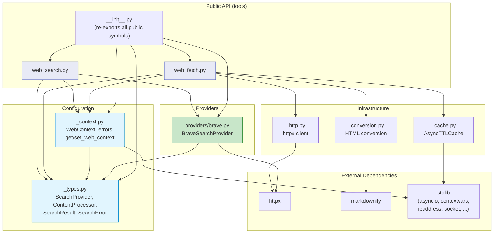

**Key properties of this dependency graph:**
- **No circular imports** — arrows only flow downward (tools → config → stdlib)
- **Infrastructure modules are independent** — `_cache.py`, `_conversion.py`, and `_http.py` don't depend on each other
- **Only two external dependencies** — `httpx` (HTTP client) and `markdownify` (HTML conversion)
- **Provider depends only on `_types.py`** — not on tools or context, keeping it decoupled

### 11.1 Module Exports

**File:** `src/rawagents/tools/builtin/web/__init__.py`

```python
"""Web tools for RawAgents.

Quick Start:
    # Set BRAVE_API_KEY env var, then:
    from rawagents.tools.builtin.web import web_search, web_fetch

    results = await web_search("python asyncio")
    content = await web_fetch("https://docs.python.org")

Custom Config:
    from rawagents.tools.builtin.web import WebContext, set_web_context

    ctx = WebContext(
        allowed_domains=["docs.python.org"],
        max_requests_per_minute=20,
    )
    set_web_context(ctx)

Custom Provider:
    from rawagents.tools.builtin.web import WebContext, set_web_context

    ctx = WebContext(search_provider=MyCustomProvider())
    set_web_context(ctx)

Custom Content Processing:
    from rawagents.tools.builtin.web import WebContext, set_web_context

    ctx = WebContext(content_processor=MyProcessor())
    set_web_context(ctx)
"""

# Unified Context
from ._context import (
    WebContext,
    WebSecurityError,
    URLValidationError,
    SSRFError,
    RateLimitExceededError,
    get_web_context,
    set_web_context,
)

# Types and Protocols
from ._types import (
    SearchProvider,
    ContentProcessor,
    SearchResult,
    SearchError,
    FetchError,
)

# Tools
from .web_search import web_search
from .web_fetch import web_fetch

# Built-in Provider
from .providers import BraveSearchProvider

__all__ = [
    # Context
    "WebContext",
    "WebSecurityError",
    "URLValidationError",
    "SSRFError",
    "RateLimitExceededError",
    "get_web_context",
    "set_web_context",
    # Types
    "SearchProvider",
    "ContentProcessor",
    "SearchResult",
    "SearchError",
    "FetchError",
    # Tools
    "web_search",
    "web_fetch",
    # Provider
    "BraveSearchProvider",
]
```

### 11.2 Provider Exports

**File:** `src/rawagents/tools/builtin/web/providers/__init__.py`

```python
"""Search providers for RawAgents web tools.

Only BraveSearchProvider is built-in. For other providers,
implement the SearchProvider Protocol — see _types.py for examples.
"""

from .brave import BraveSearchProvider

__all__ = ["BraveSearchProvider"]
```

### 11.3 Update builtin/__init__.py

```python
# src/rawagents/tools/builtin/__init__.py
"""Built-in tools for RawAgents.

- **fs**: File system tools (read, write, edit, list, glob, grep, etc.)
- **shell**: Shell/command execution tools (bash, bash_output, kill_shell)
- **web**: Web tools (web_search, web_fetch)
"""

from rawagents.tools.builtin import fs, shell, web

__all__ = ["fs", "shell", "web"]
```

---

## 12. Development Process

### 12.1 Phase 1: Foundation (Days 1-2)

**Objective:** Build core infrastructure.

**Tasks:**

1. **_context.py** (WebContext, URL validation, SSRF prevention, rate limiting)
   - Single unified WebContext dataclass
   - validate_url() with async DNS resolution
   - check_rate_limit() with per-operation tracking
   - All SSRF helper methods
   - get_web_context() / set_web_context() with allow_permissive
   - Error classes (WebSecurityError, URLValidationError, SSRFError, RateLimitExceededError)

2. **_types.py** (Protocols and data classes)
   - SearchProvider Protocol with complete docstring + example
   - ContentProcessor Protocol with complete docstring + example
   - SearchResult dataclass
   - SearchError, FetchError exceptions

3. **_cache.py** (AsyncTTLCache)
   - TTL expiry, LRU eviction
   - Thundering herd prevention via asyncio.Event
   - get/set/get_or_wait/wait_for_inflight/cancel_inflight/clear

4. **_conversion.py** (HTML→Markdown/Text)
   - markdownify with ATX heading style
   - Regex-based HTML stripping for text format
   - HTML passthrough

5. **_http.py** (Shared httpx client)
   - CloudflareRetryTransport
   - Shared client with connection pooling

### 12.2 Phase 2: Core Tools (Days 3-4)

**Objective:** Implement web_search and web_fetch tools.

**Tasks:**

1. **web_fetch.py** (Full implementation)
   - @tool async function
   - URL validation, SSRF check, rate limiting via WebContext
   - HTTP fetch, content conversion, caching
   - Optional ContentProcessor hook
   - Content truncation, redirect detection
   - Binary content type rejection
   - Error handling

2. **web_search.py** (with provider dispatch)
   - @tool async function
   - Provider auto-creation from BRAVE_API_KEY if not configured
   - Query validation, domain filtering, rate limiting
   - Format results as numbered markdown links
   - Error handling

3. **providers/brave.py** (BraveSearchProvider)
   - Brave Search REST API integration
   - Domain filtering, error handling
   - Free tier: 2k searches/month

4. **__init__.py** files (web module + builtin update)

### 12.3 Phase 3: Testing & Polish (Days 5-7)

**Objective:** Complete test suite and documentation.

**Tasks:**

1. **Unit tests** (all modules: tools, security, cache, conversion, HTTP, provider)
2. **Integration tests** (real Brave API, real URL fetch, Cloudflare retry, cache persistence)
3. **Content processor tests** (mock processor, pipeline verification)
4. **Documentation** (docstrings, module docs, type hints)
5. **Dependencies** (update pyproject.toml: httpx, markdownify as required; h2 as optional for HTTP/2)

---

## 13. Error Handling and Logging

### 13.1 Error Message Format

All errors follow: `Error: <Human-readable description>`

```
Error: URL must start with http:// or https://
Error: Domain 'example.com' is blocked
Error: Cannot fetch private/internal URLs (resolved to 10.0.0.1)
Error: Search rate limit exceeded. Max 10 per minute.
Error: HTTP 404: Not Found
Error: Request timed out after 30 seconds
Error: Response exceeds 5MB size limit
Error: Cannot fetch binary content (Content-Type: application/pdf)
Error: No search provider configured. Set BRAVE_API_KEY environment variable, or pass a custom SearchProvider to WebContext.
Error: Content processing failed: {details}
```

### 13.2 Complete Error Table

| Scenario | Tool | Error Message |
|----------|------|---------------|
| Invalid URL scheme | web_fetch | `Error: URL must start with http:// or https://` |
| Domain in blocklist | web_fetch | `Error: Domain '{domain}' is blocked` |
| SSRF attempt | web_fetch | `Error: Cannot fetch private/internal URLs (resolved to {ip})` |
| Response too large | web_fetch | `Error: Response exceeds 5MB size limit` |
| HTTP error | web_fetch | `Error: HTTP {code}: {reason}` |
| Request timeout | web_fetch | `Error: Request timed out after {N} seconds` |
| Connection refused | web_fetch | `Error: Failed to connect to {domain}: {reason}` |
| Binary content | web_fetch | `Error: Cannot fetch binary content (Content-Type: {ct})` |
| ContentProcessor error | web_fetch | `Error: Content processing failed: {details}` |
| Empty query | web_search | `Error: Search query cannot be empty` |
| Both domain lists | web_search | `Error: Cannot use both allowed_domains and blocked_domains` |
| No provider | web_search | `Error: No search provider configured. Set BRAVE_API_KEY environment variable, or pass a custom SearchProvider to WebContext.` |
| Provider API error | web_search | `Error: Search failed: {details}` |
| Search rate limit | web_search | `Error: Search rate limit exceeded. Max {limit} per minute.` |
| Fetch rate limit | web_fetch | `Error: Fetch rate limit exceeded. Max {limit} per minute.` |

### 13.3 Logging Strategy

- **DEBUG**: Cache hits/misses, provider selection, URL resolution
- **INFO**: Successful operations (search query + result count, fetch URL + content size)
- **WARNING**: Redirects, content truncation, rate limit approaching
- **ERROR**: Failed operations, security violations, provider errors

### 13.4 Special Output Cases

**Content Truncation:**
```
[Content truncated at 100KB. Full page available at: https://example.com]
```

**Cross-Host Redirect:**
```
Redirect detected: https://example.com/old redirects to https://newhost.com/page.
Fetch the new URL directly if needed: https://newhost.com/page
```

**text/markdown Passthrough:**
```python
# If Content-Type is text/markdown and format is "markdown", skip conversion
if "text/markdown" in content_type and format == "markdown":
    return response.text
```

---

## 14. Developer FAQ & Design Decisions

This section addresses questions raised during the dev team review (v2.2 review cycle). Each answer captures the rationale so future contributors don't revisit settled decisions.

### Q1: Are `httpx` and `markdownify` optional or required dependencies?

**Answer: Required.** Both `httpx` and `markdownify` are listed under `[project.dependencies]` (not `[project.optional-dependencies]`). Every web tool function depends on them — `httpx` for all HTTP communication and `markdownify` for HTML→Markdown conversion. There is no fallback path if they are absent, so they must install with `pip install rawagents`.

The *only* optional dependency is `h2>=4.0.0` (the `web-http2` extra), which enables HTTP/2 support for users who need it. See Appendix A for the full dependency table.

### Q2: Should we auto-detect other search providers, or is Brave-only sufficient for v1?

**Answer: Brave-only is sufficient for v1.** The `SearchProvider` Protocol exists precisely so that users *can* plug in alternatives (Tavily, Exa, SearXNG, etc.), but v1 ships with only `BraveSearchProvider` built in. Reasons:

1. **Scope control** — shipping one well-tested provider is better than shipping several partially tested ones.
2. **Brave is the reference provider** used by both Claude Code and OpenCode, so it is the most battle-tested option.
3. **The Protocol makes adding providers trivial** — implementers write ~20 lines of code (see Section 8.1 and Appendix B).

If demand arises, additional built-in providers can be added in v2 without breaking changes.

### Q3: The `brave-search` SDK is listed in optional dependencies — is it actually used?

**Answer: No — it has been removed.** The `BraveSearchProvider` implementation uses `httpx` directly to call the Brave REST API (`https://api.search.brave.com/res/v1/web/search`). It never imports or uses the `brave-search` Python SDK. The SDK was incorrectly listed in earlier drafts and has been removed as of v2.2. See the updated Appendix A.

### Q4: What is the lifecycle and scope of the URL cache? Per-request? Per-session?

**Answer: Module-level singleton, per-process.** The `AsyncTTLCache` instance is a module-level singleton created lazily on first use (see Section 8.6). This means:

- It persists for the lifetime of the Python process (like `ProcessManager` in the shell tools module).
- All calls to `web_fetch` within the same process share the same cache.
- Entries expire after 15 minutes (configurable via `WebContext.cache_ttl`).
- Setting `cache_ttl=0` in `WebContext` disables caching entirely (useful for tests).

The cache is **not** shared across processes. If a user runs multiple agent instances in separate processes, each gets its own cache. This is the simplest correct behavior for v1.

### Q5: How are oversized responses handled — buffered or streamed?

**Answer: Streamed with early rejection.** As specified in Section 5.2, `web_fetch` uses httpx streaming (`async with client.stream(...)`) to avoid buffering oversized responses into memory. The flow is:

1. **Content-Length check** — if the server sends a `Content-Length` header exceeding 5 MB, the request is rejected *immediately* without reading the body.
2. **Streaming check** — if no `Content-Length` header is present (e.g., chunked transfer), the response is read in chunks, tracking total bytes. If the 5 MB threshold is crossed mid-stream, reading aborts and returns an error.

This two-tier approach prevents OOM on very large responses while remaining compatible with servers that don't send `Content-Length`.

---

## Appendix A: Dependencies

### Required Dependencies

```toml
[project]
dependencies = [
    # ... existing dependencies ...
    "httpx>=0.27.0,<1.0.0",       # Async HTTP client (latest stable: 0.28.1)
    "markdownify>=0.14.0,<1.0.0",  # HTML→Markdown conversion
]
```

### Optional Dependencies

```toml
[project.optional-dependencies]
web-http2 = ["h2>=4.0.0"]  # Optional: enables HTTP/2 support in httpx
```

**Note:** The `brave-search` SDK is **not needed**. `BraveSearchProvider` uses httpx directly to call the Brave REST API. No SDK dependency required.

**Note on HTTP/2:** httpx supports HTTP/2 but requires the separate `h2` package. HTTP/2 is NOT enabled by default in our implementation (HTTP/1.1 is sufficient). If users want HTTP/2, they install `rawagents[web-http2]` and pass `http2=True` when creating httpx clients.

### Installation

```bash
# Standard (all web tools work out of the box)
pip install rawagents

# With HTTP/2 support (optional)
pip install rawagents[web-http2]
```

### Alternative HTML Conversion Library (Future Consideration)

For v1, we use `markdownify` — it's lightweight, well-maintained, and sufficient. For v2, consider [`html-to-markdown`](https://pypi.org/project/html-to-markdown/) — a Rust-backed library that is 10-80x faster (150-280 MB/s throughput) with CommonMark compliance. This could be beneficial for high-throughput agent workloads that process many web pages. The API is similar enough that swapping would require minimal code changes.

---

## Appendix B: Provider Comparison (Reference)

For users choosing a custom search provider:

| Provider | API | Free Tier | Quality | Speed | Auth |
|----------|-----|-----------|---------|-------|------|
| **Brave** (built-in) | REST | 2k/mo | High | Fast | API key |
| **Tavily** | REST | 100/mo | High | Medium | API key |
| **Exa** | REST | Free tier | Very High | Fast | API key |
| **SearXNG** | Self-hosted | Unlimited | Varies | Fast | None |
| **DuckDuckGo** | Unofficial | Unlimited | Good | Fast | None |

Users implement SearchProvider Protocol (~20 lines) to use any of these.

---

## Appendix C: Configuration Examples

### Zero-Config (Most Common)

```python
# export BRAVE_API_KEY=BSA-xxxxx
from rawagents.tools.builtin.web import web_search, web_fetch

results = await web_search("python asyncio")
content = await web_fetch("https://docs.python.org")
```

### Restricted Domains

```python
from rawagents.tools.builtin.web import WebContext, set_web_context

ctx = WebContext(
    allowed_domains=["docs.python.org", "readthedocs.io", "github.com"]
)
set_web_context(ctx)
```

### Block Social Media

```python
ctx = WebContext(
    blocked_domains=["pinterest.com", "twitter.com", "facebook.com", "linkedin.com"]
)
set_web_context(ctx)
```

### Custom Search Provider

```python
from rawagents.tools.builtin.web import WebContext, set_web_context

class MyExaProvider:
    """Implement SearchProvider Protocol for Exa."""
    async def search(self, query, *, num_results=10,
                     allowed_domains=None, blocked_domains=None):
        import httpx
        async with httpx.AsyncClient() as client:
            resp = await client.post("https://api.exa.ai/search",
                json={"query": query, "numResults": num_results},
                headers={"x-api-key": os.environ["EXA_API_KEY"]})
            return [SearchResult(title=r["title"], url=r["url"],
                                 snippet=r.get("text", ""), source="exa")
                    for r in resp.json()["results"]]

    @property
    def name(self): return "exa"

ctx = WebContext(search_provider=MyExaProvider())
set_web_context(ctx)
```

### Custom Content Processor

```python
ctx = WebContext(content_processor=HaikuExtractionProcessor())
set_web_context(ctx)

# See Section 7 for full ContentProcessor examples
```

### Strict Rate Limits

```python
ctx = WebContext(max_requests_per_minute=5, max_search_per_minute=2)
set_web_context(ctx)
```

### Disable Caching

```python
ctx = WebContext(cache_ttl=0)
set_web_context(ctx)
```

### Everything Custom

```python
ctx = WebContext(
    # Security
    allowed_domains=["docs.python.org", "github.com"],
    allow_localhost=False,
    allow_private_ips=False,
    # Rate limits
    max_requests_per_minute=20,
    max_search_per_minute=5,
    # Provider
    search_provider=MyCustomProvider(),
    # Processing
    content_processor=MyProcessor(),
    # Caching
    cache_ttl=600,  # 10 minutes
    # HTTP
    user_agent="MyAgent/1.0",
    max_retries=3,
)
set_web_context(ctx)
```

---

## Appendix D: Implementation Notes

### D.1 Cross-Host Redirect Detection

```python
async def fetch_with_redirect_detection(
    client: httpx.AsyncClient, url: str,
) -> tuple[httpx.Response, str | None]:
    """Fetch URL and detect cross-host redirects."""
    from urllib.parse import urlparse
    original_host = urlparse(url).hostname
    response = await client.get(url, follow_redirects=True)
    final_host = urlparse(str(response.url)).hostname
    if original_host != final_host:
        return response, str(response.url)
    return response, None
```

### D.2 Binary Content Type Handling

```python
BINARY_CONTENT_TYPES = {
    "image/", "audio/", "video/", "application/octet-stream",
    "application/zip", "application/gzip", "application/pdf",
}

def is_binary_content_type(content_type: str) -> bool:
    ct = content_type.lower().split(";")[0].strip()
    return any(ct.startswith(prefix) for prefix in BINARY_CONTENT_TYPES)
```

### D.3 Encoding and Charset

httpx handles charset detection automatically via `response.text`. It respects the Content-Type charset header, falls back to UTF-8, then Latin-1.

### D.4 Registering Web Tools with ToolExecutor

```python
from rawagents.tools import ToolExecutor
from rawagents.tools.builtin.web import web_search, web_fetch

executor = ToolExecutor([
    # ... existing fs and shell tools ...
    web_search,
    web_fetch,
])
schemas = executor.get_schemas()  # Includes web tool schemas for LLM
```

---

**End of PRD**
