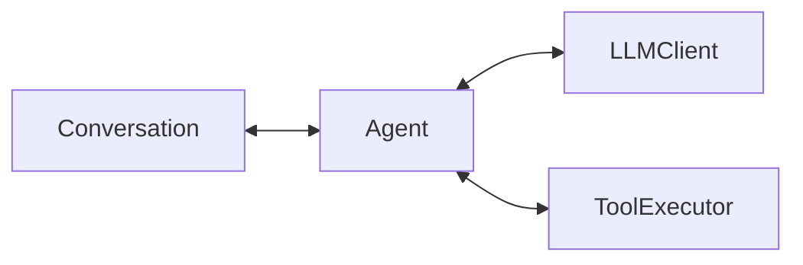

# Vision: The "Lego Kit" for Agentic Systems

**Date:** November 2025
**Status:** Living Document
**Author:** Tawab Safi

---

## 1. The "Why"

We built RawAgents because we needed a **thin, transparent wrapper** that provides the *essential primitives* for building agents without imposing a specific architecture.

Our goal is to enable **researchers and developers** to:

- Rapidly prototype standard agents (Chatbots, RAG)
- Easily experiment with novel architectures (recursive planning, self-optimizing loops)
- Programmatically search for the optimal agent structure for a given task

---

## 2. Core Philosophy: "State before Execution"

Our architecture separates **State** (Memory), **Capabilities** (Tools), and **Compute** (LLM) into distinct, swappable components. The "Agent" is merely the runtime loop that binds them together.

### The Primitive Triad

Every agent, no matter how complex, is composed of three atomic parts:

1. **Compute (`LLMClient`)**:
   - *Role:* The brain. Stateless text-in, text/struct-out.
   - *Principle:* Universal API. Whether it's GPT-4, Claude, or a local Llama, the interface is identical. It signals *intent* (e.g., "Call this tool") but never executes action.

2. **Memory (`Conversation`)**:
   - *Role:* The operating system for context.
   - *Principle:* Append-only log. Supports standard chat history, tool outputs, and multimodal content. It manages the "Context Window" via pluggable strategies (Sliding Window, Summarization) so the Agent doesn't crash.

3. **Capabilities (`ToolExecutor`)**:
   - *Role:* The hands.
   - *Principle:* Pure functions. A tool is just a Python function with a schema. The Executor manages the registry, schema generation, and safe execution. It is stateless and reusable across agents.

---

## 3. The "Agent" Abstraction

In RawAgents, an `Agent` is not a black box. It is a **Controller** that implements a specific loop.

### Single Agent Architecture

The simplest unit.

The Agent reads from Conversation, consults LLMClient, executes via ToolExecutor, and writes back to Conversation.

### Deep Agents (Recursion)

Because our `Agent` exposes a simple text-in/text-out interface, **an Agent can be a Tool**.

- A "Master Agent" can have a tool called `ask_coder`.
- Executing `ask_coder` spins up a sub-agent with its own Conversation and Tools.
- This enables infinite nesting and specialization without complex definitions.

### Workflows (State Machines)

Complex tasks often require deterministic steps mixed with LLM reasoning.

- Instead of a single loop, users can define a **Workflow**: a sequence where the output of Agent A feeds into the context of Agent B.
- The `Conversation` component acts as the shared state passed between steps.

---

## 4. Future Vision: "Agent Optimization"

Because we define agents via **Configuration as Code** (Pydantic models for Tools, Context Strategies, and Prompts), we unlock the ability to **search** for the best agent.

- **Structural Search**: "Should this be one big agent or three small specialist agents?" → We can programmatically generate both configs and eval them.
- **Prompt Optimization**: "What is the best system prompt?" → We can iterate on the config.
- **Tool Selection**: "Which tools maximize performance?" → We can A/B test toolsets.

---

## 5. Use Cases

1. **Research**: Testing a new "Reflection" loop. (Just write a custom Agent loop using the primitives).
2. **Production**: Deploying a customer service bot. (Use the standard loop with persistent storage).
3. **Complex Tasks**: Building a "Software Engineer" agent that plans, writes, tests, and fixes code using sub-agents.

---

## 6. What RawAgents Is Not

- **Not a Vector DB**: We integrate with them, we don't build them.
- **Not an API Gateway**: We are a library, not a hosted service.
- **Not a DAG Engine**: We provide loops, not workflow orchestration.

---

## 7. Summary

We build the **Lego Bricks**. The user builds the Castle.

We ensure the bricks snap together perfectly, but we don't tell the user what castle to build.
